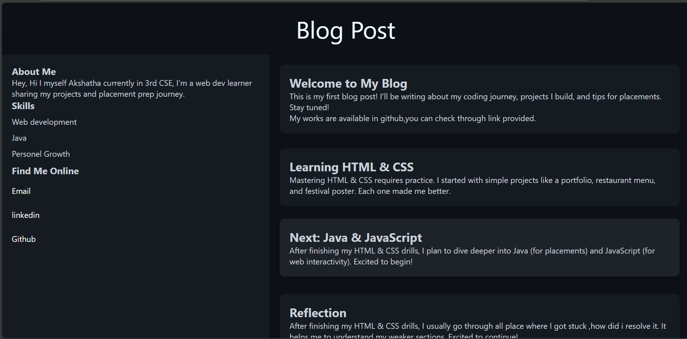

# 📝 Blog Layout

## 📌 Overview
A simple **Blog Page Layout** built using **HTML5 and CSS3 (Flexbox)**.  
The layout includes:
- **Header** (blog title)
- **Sidebar** (skills / categories)
- **Main Content Area** (blog posts)
- **Footer**

---

## 🚀 Features
- Responsive **Flexbox Layout**  
- Semantic HTML elements (`<header>`, `<aside>`, `<main>`, `<article>`, `<footer>`)  
- Clean and minimal design  

---

## 🛠️ Tech Used
- HTML5  
- CSS3  

---

## 🏃 How to Run
1. Clone or download this repository  
2. Open `index.html` in your browser  

---

## ✨ Future Improvements
- Make layout fully **responsive** for mobile  
- Add navigation menu  

---
 ## Reflection

While building this project, I learned:
- How to structure a simple HTML page with semantic tags.
- How to link CSS stylesheets and apply consistent styling.
- Importance of folder structure (keeping `images/`, `style.css`, `index.html` organized).
- Basic Git workflow (`git add`, `git commit`, `git push`) for version control.

Challenges I faced:
- Forgetting to stage changes before committing (solved using `git add .`).
- Adjusting CSS layout for proper alignment.

Next Steps:
- Make the page responsive using media queries.
- Add more screenshots to showcase the layout.
- Experiment with different color themes and typography.

---

## Preview  
  

---

## 👨‍💻 Author
Built with ❤️ by Akshatha S
